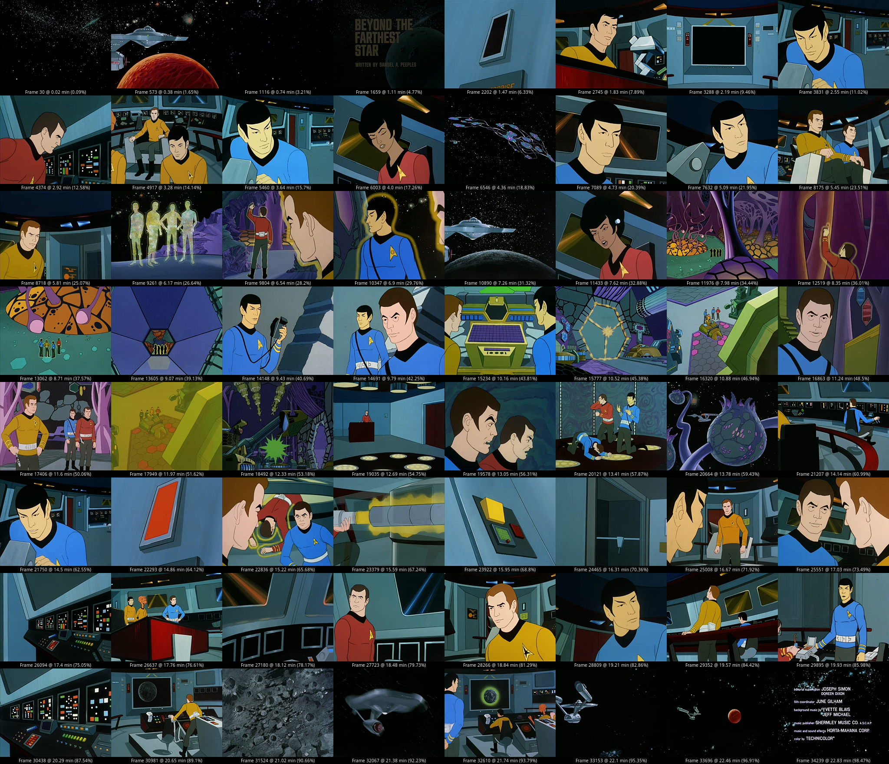
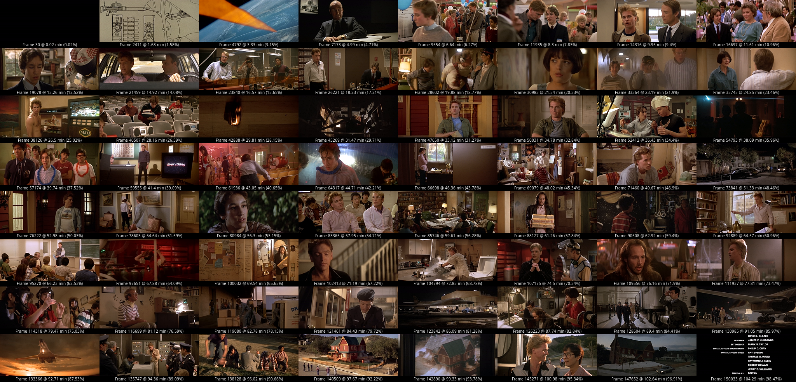

# extract-grid-overview

Creates a montage grid of frames from a video file with frame and time offset labels to help give a basic summary of the video file contents.

_WARNING_: This is an extremely kludgy tool that makes a real mess but tries to clean up afterward. If you stop it mid-process you might have a bunch of .png files to clean up. This is seriously janky and will probably be unhappy with small files with large grid sizes.

There are ABSOLUTELY better ways to do this, but it works "good enough" for my purposes. (You know how that goes.) I will likely circle back at some point and make further improvements. 🤞

## Requirements

- `ffmpeg` (including `ffprobe`)
- imagemagick (with included `convert` and `montage`)

## Example Output

### _Star Trek: The Animated Series_, Default 8x8 (4:3)

### _Real Genius_, 8x8 (widescreen)

### _Max Headroom_, 20x20 (4:3)

